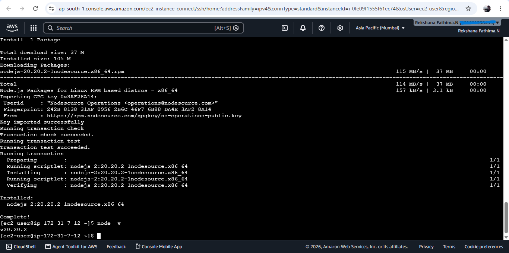
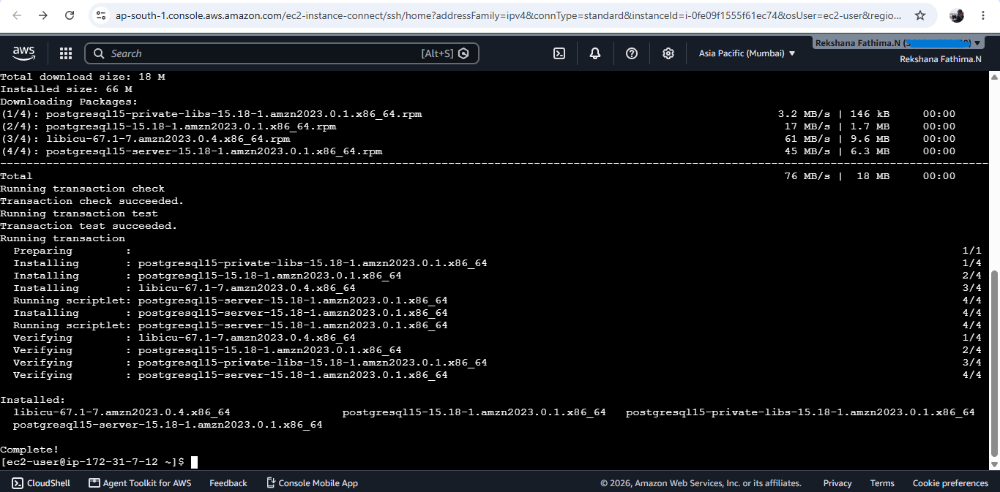
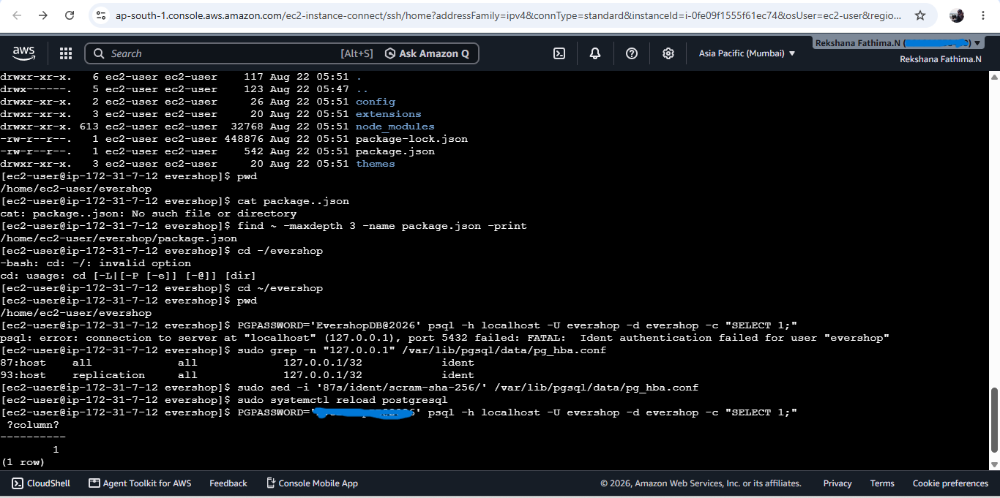
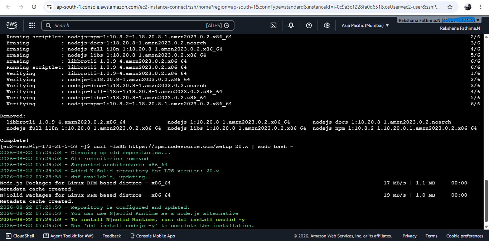

# Prerequisites and Environment Setup

This section documents the initial environment setup performed before deploying and configuring the E-commerce application on AWS.

## 1. Node.js Installation

Node.js was installed on the Amazon Linux 2023 EC2 instance as a prerequisite for running the Evershop application.

The Node.js version was verified after installation.

---

## 2. PostgreSQL Installation

PostgreSQL was installed and configured on the EC2 instance to provide the database backend required by the Evershop application.

---

## 3. PostgreSQL Database Connection Verification

The PostgreSQL database connection was tested successfully using a `SELECT 1` query.

This confirmed that the application database user could successfully connect to the Evershop database.

---

## 4. Node.js Environment Update

The initial Node.js package was removed as part of updating the runtime environment before installing the required Node.js version.

---

## Environment Summary

| Component | Purpose |
|---|---|
| Amazon Linux 2023 | EC2 operating system |
| Node.js | Evershop application runtime |
| npm | Node.js package manager |
| PostgreSQL | Evershop database |
| EC2 | Application hosting environment |

These prerequisites provided the base environment required for the subsequent AWS cloud deployment tasks.
