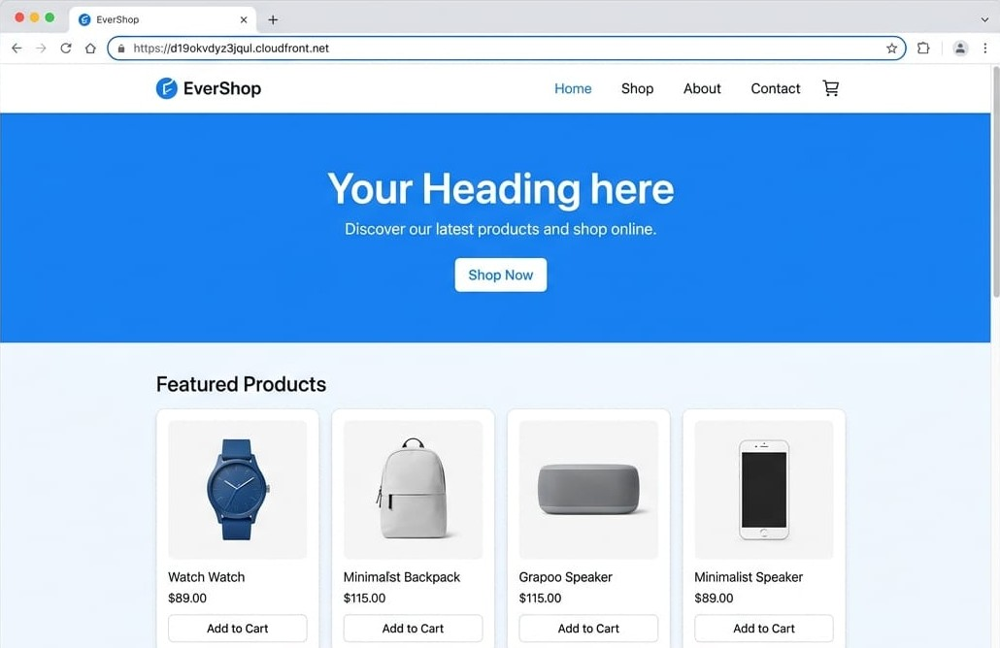

# Final Result

## Project Completion Summary

The Elevance Skills AWS internship project provided hands-on experience in designing, configuring, deploying, and troubleshooting a cloud-based e-commerce application using AWS services.

The project covered six major areas:

| Task | AWS Services | Result |
|---|---|---|
| 1 | Route 53, ACM, CloudFront, WAF | Infrastructure configured |
| 2 | RDS, IAM, Secrets Manager | Database and credential management configured |
| 3 | Auto Scaling, Mixed Instances | Scaling infrastructure configured |
| 4 | ECS, ECR, ALB, CloudWatch | Container deployment infrastructure configured |
| 5 | CloudFront, Lambda@Edge | CDN and edge configuration completed |
| 6 | S3, CloudFront, S3 Object Lambda | Product image storage architecture configured |

## Key AWS Components

The final project architecture included:

- Amazon ECS for containerized application deployment
- Amazon ECR for Docker image management
- Amazon RDS PostgreSQL for database storage
- AWS Secrets Manager for secure credentials
- Application Load Balancer for application traffic
- Amazon CloudFront for content delivery
- Amazon S3 for product image storage
- S3 Object Lambda for object-level processing
- AWS WAF for web application protection
- Route 53 for DNS configuration
- AWS Certificate Manager for TLS/HTTPS
- Auto Scaling for application capacity management
- CloudWatch for monitoring and troubleshooting

## Deployment Flow

Docker Image
↓
Amazon ECR
↓
Amazon ECS
↓
Application Load Balancer
↓
Amazon CloudFront
↓
End User

Application Database Flow:

Amazon ECS
↓
Amazon RDS PostgreSQL

Secure Credential Flow:

Amazon ECS
↓
AWS Secrets Manager

## Testing & Troubleshooting

During final application validation, the ECS deployment experienced task failures.

The ECS task logs were reviewed through CloudWatch.

A database connectivity error was identified:

`connect ECONNREFUSED 127.0.0.1:5432`

The error indicated that the application was attempting to connect to PostgreSQL through the container's localhost address instead of successfully reaching the configured RDS endpoint.

The issue was investigated through:

- ECS service events
- ECS task stopped reasons
- CloudWatch container logs
- RDS configuration
- Security group configuration
- Application Load Balancer target status

This troubleshooting process provided practical experience with diagnosing containerized application deployment issues on AWS.

## Final Application Status

The AWS infrastructure and supporting services were configured as part of the deployment exercise.

The final storefront URL used during testing was:

https://d19okvdyz3jqul.cloudfront.net

The CloudFront distribution was configured; however, final end-to-end storefront accessibility was not successfully validated because of the ECS application/database connectivity and ALB target registration issues encountered during testing.

The CloudFront URL is therefore documented as the deployment testing endpoint rather than as a confirmed production-live website.

## Key Learning Outcomes

This project helped develop practical knowledge of:

- AWS cloud infrastructure
- Docker and containerization
- Amazon ECS and ECR
- Application Load Balancer
- PostgreSQL and Amazon RDS
- IAM
- AWS Secrets Manager
- Amazon S3
- CloudFront
- AWS WAF
- Route 53
- ACM
- Auto Scaling
- CloudWatch
- Cloud troubleshooting
- Security configuration
- Cost and resource awareness
- Technical documentation

## Conclusion

This project provided practical exposure to deploying and troubleshooting a real-world style e-commerce application on AWS.

The project involved multiple AWS services working together as a cloud architecture rather than a single-service deployment.

## Final Result

### EverShop Storefront UI Preview

The following mockup illustrates the intended storefront appearance for the deployed EverShop application.

**Note:** This is a UI reference/mockup for documentation. The CloudFront endpoint was configured during the deployment exercise, but final end-to-end storefront accessibility could not be validated due to ECS/ALB and database connectivity issues.
The troubleshooting experience was particularly valuable because it demonstrated how ECS task failures, application logs, database connectivity, security groups, and load balancer target health can affect an end-to-end cloud application.

Overall, the project strengthened my understanding of AWS infrastructure, containerized application deployment, cloud security, monitoring, scalability, and troubleshooting.
