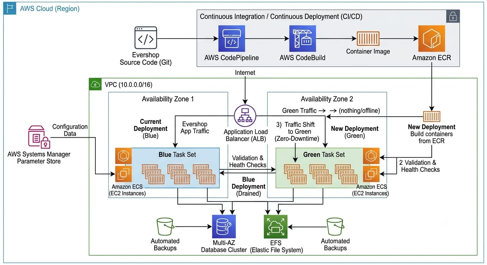

# Task 4 — Immutable E-commerce Deployment with ECS & ECR

## Project Overview

Containerize and deploy the Evershop application using Amazon ECS on EC2 instances with Amazon ECR for container image storage. Application configuration is managed through AWS Systems Manager Parameter Store, with AWS CodePipeline and CodeBuild planned for automated CI/CD and zero-downtime blue/green deployments.

## Architecture

The following diagram represents the AWS infrastructure designed for the containerized Evershop application deployment.

## Amazon ECR Private Repository

Created a private Amazon ECR repository named `evershop` for storing Evershop container images.

## AWS Systems Manager Parameter Store

Created Standard String parameters in AWS Systems Manager Parameter Store for Evershop application configuration.

The configured parameters are:

- `/evershop/app/environment` — `production`
- `/evershop/app/port` — `3000`
