# Task 1 – AWS Web Application Infrastructure

## Project Overview

This task focuses on building the core AWS infrastructure for the Evershop web application.

The infrastructure was configured using Amazon VPC, subnets, route tables, security groups, Amazon EC2, an Application Load Balancer, a target group, and Amazon CloudFront.

---

## Architecture

The following diagram represents the AWS infrastructure created for the Evershop application.

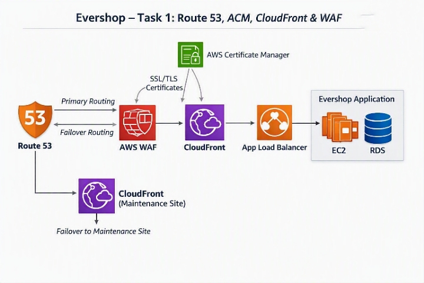

---

## 1. VPC

Created the Evershop VPC with an IPv4 CIDR block of `10.0.0.0/16`.

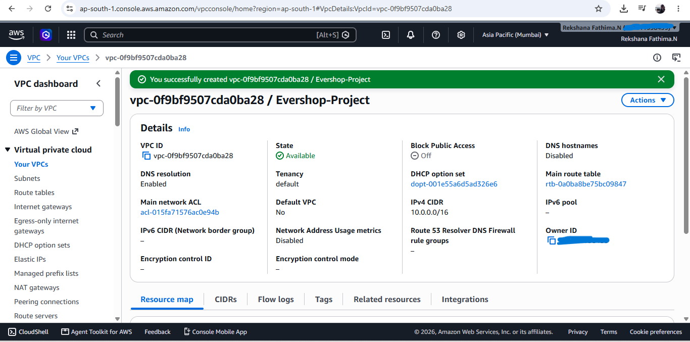

---

## 2. Subnets

Configured public and private subnets across multiple Availability Zones within the Evershop VPC.

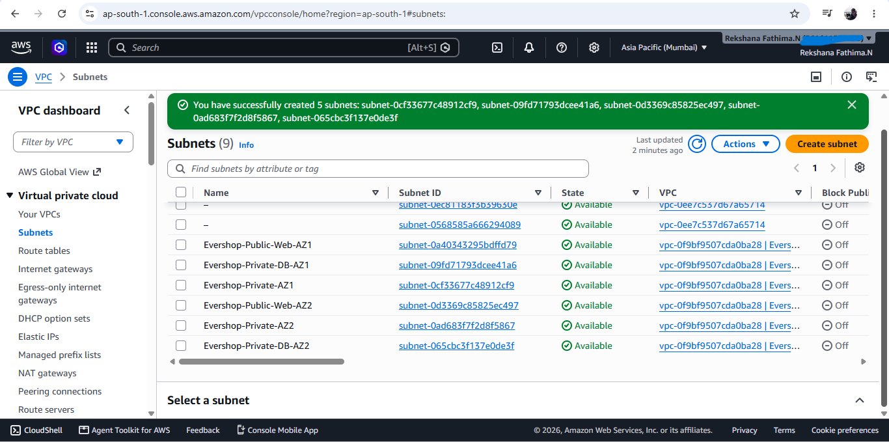

---

## 3. Internet Gateway

Configured an Internet Gateway to provide internet connectivity for the public network.

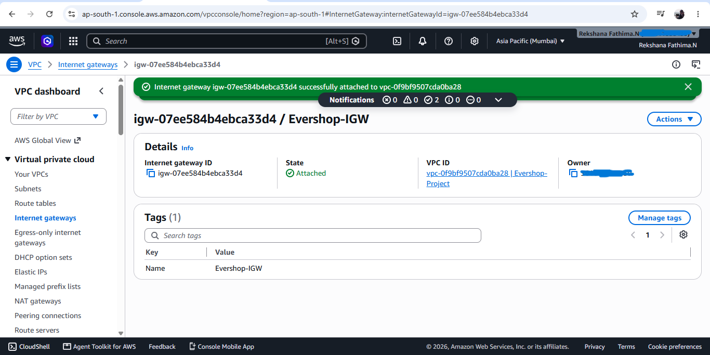

---

## 4. Route Tables

Configured route tables to control traffic between the public and private subnets and the required network destinations.

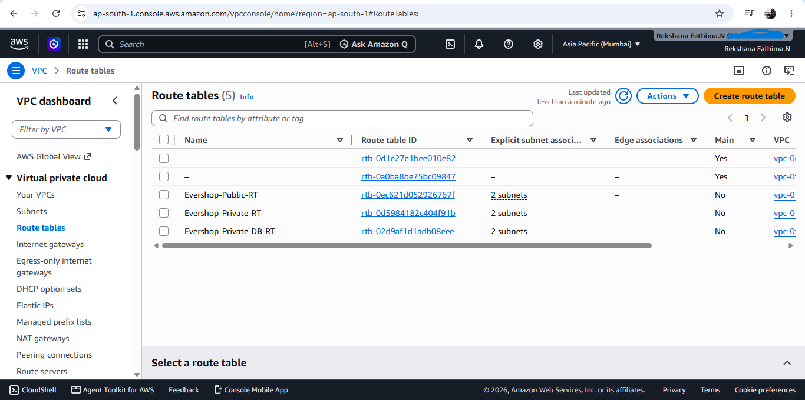

---

## 5. Security Groups

Configured security groups for the Application Load Balancer and web tier to control inbound and outbound traffic.

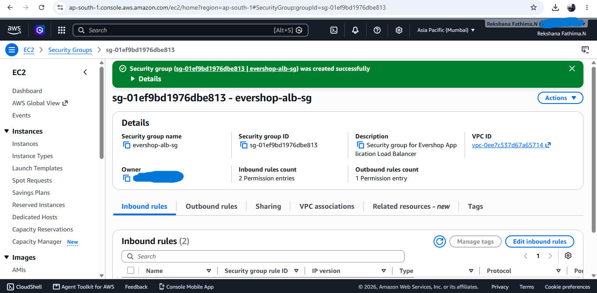

---

## 6. EC2 Instance

Launched an Amazon EC2 instance to host the web application.

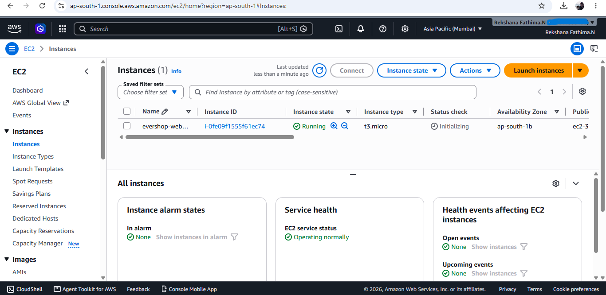

---

## 7. Target Group

Created a target group and registered the EC2 web server as a target for the Application Load Balancer.

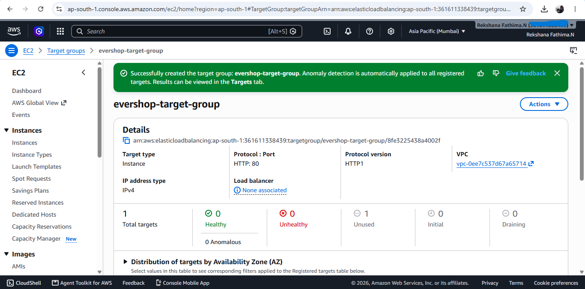

---

## 8. Application Load Balancer

Created an internet-facing Application Load Balancer and configured it to forward HTTP traffic to the target group.

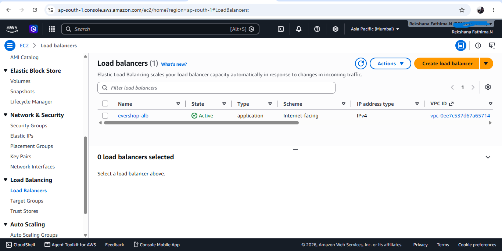

---

## 9. CloudFront

Created an Amazon CloudFront distribution using the Application Load Balancer as the origin.

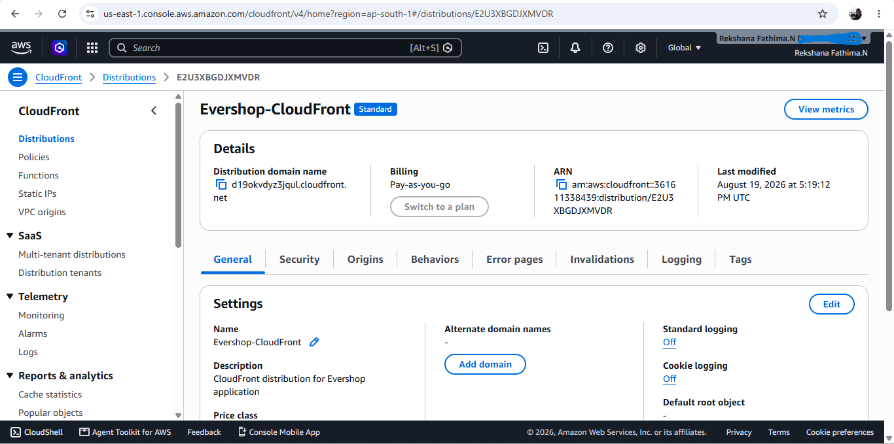

---

## AWS WAF Protection Pack

Created the AWS WAF protection pack named `EverShop Cloud Front WAF` to protect the Evershop CloudFront distribution against common web application threats.

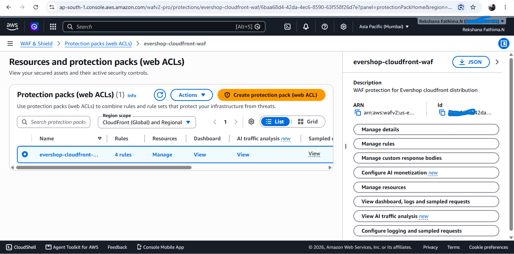

## WAF Resources and Protection Packs

Configured the WAF protection resources and Web ACL for the Evershop CloudFront distribution.

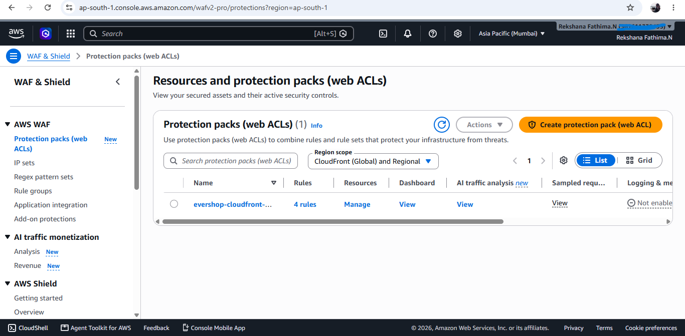

## CloudFront Web Application Firewall

Enabled AWS WAF security protection for the Evershop CloudFront distribution to help protect the application from common web threats and vulnerabilities.

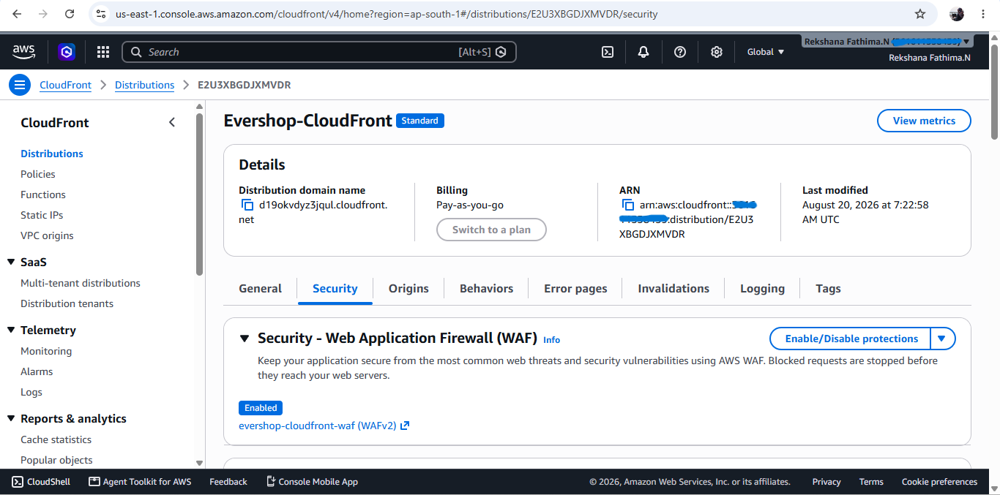
