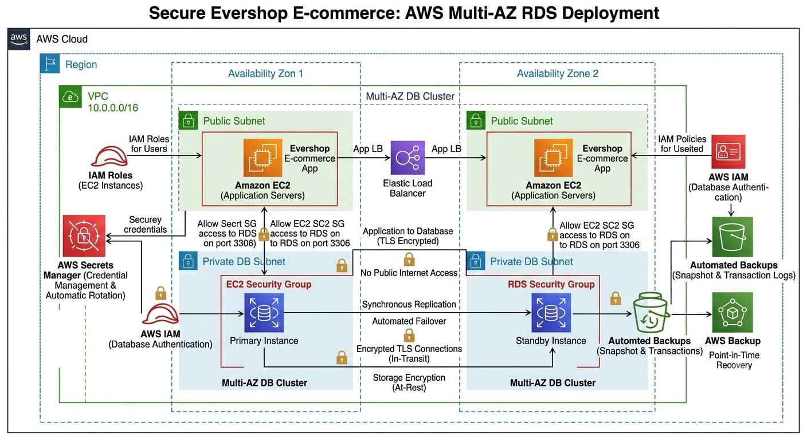
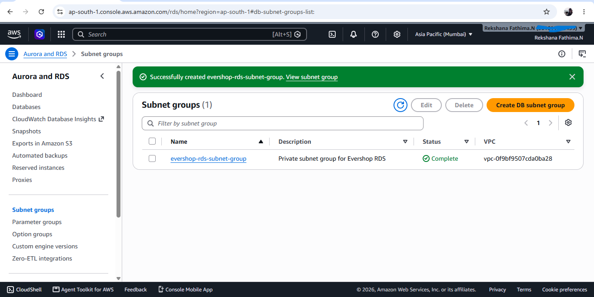
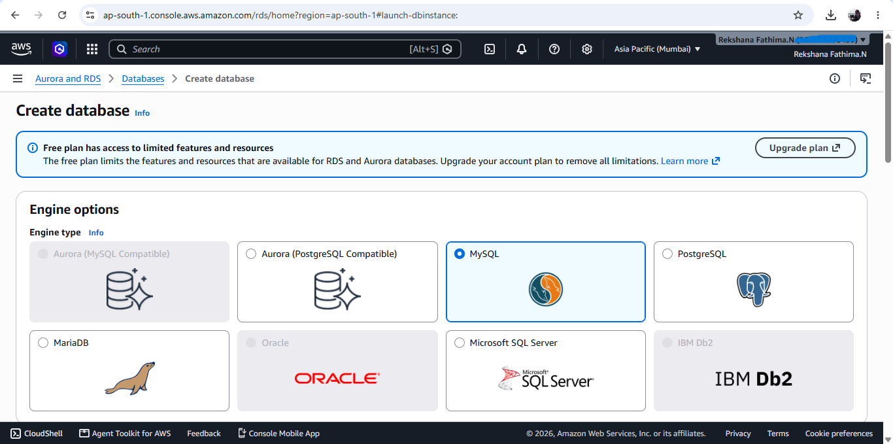
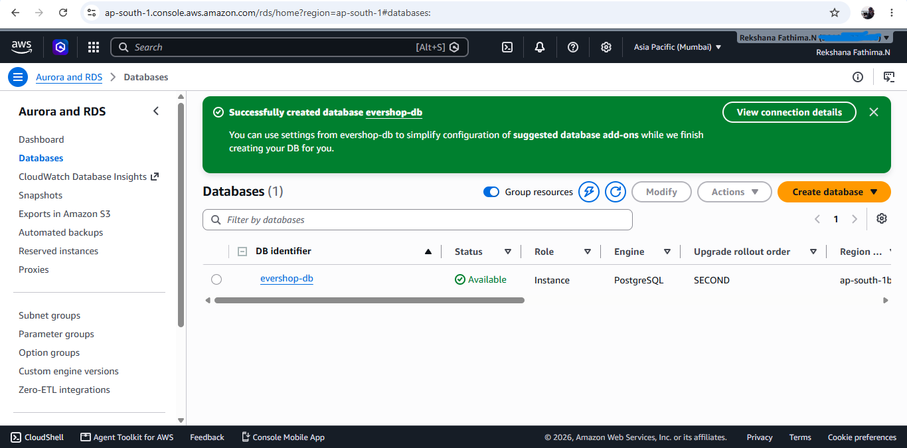
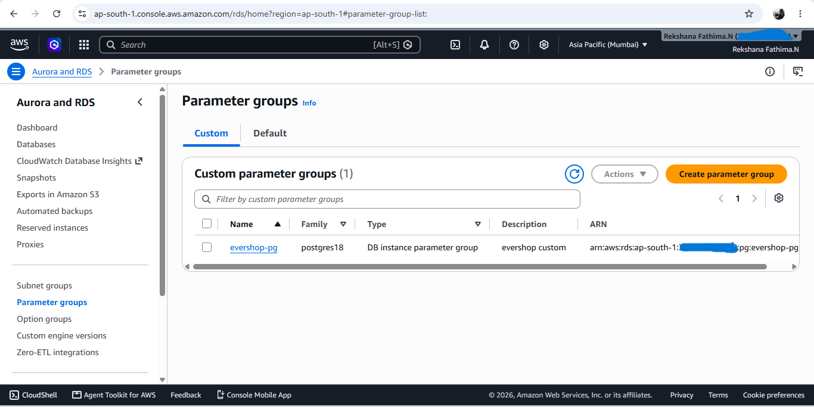
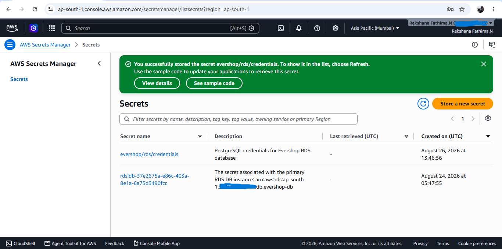
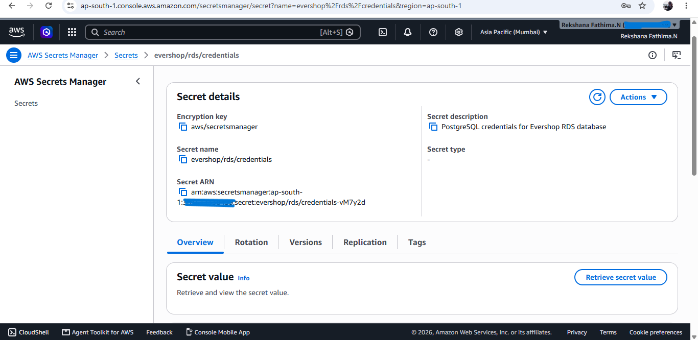

# Task 2 — Secure RDS Deployment with IAM & Rotation 

## Project Overview

Deploy a secure Multi-AZ MySQL Amazon RDS database for the Evershop application in private subnets with no public access. The architecture includes IAM database authentication, TLS-only connections, AWS Secrets Manager credential management with automatic rotation, encryption, backups, and point-in-time recovery.

## Architecture

The following diagram represents the AWS infrastructure designed for the secure Evershop RDS deployment.

## 1. RDS DB Subnet Group

Created the Evershop RDS DB subnet group using private database subnets across two Availability Zones.

## 2. RDS Free Plan Limitation

Verified that the AWS Free Plan currently provides only Single-AZ deployment for the MySQL RDS configuration, while the project requirement specifies Multi-AZ deployment. The RDS database was therefore not created.

### 3. RDS Database
The PostgreSQL database was created in Amazon RDS to provide the database backend for the Evershop application.

### 4. RDS Parameter Group
The parameter group was reviewed and configured for the database engine settings used by the application.

### 5. Secrets Manager
AWS Secrets Manager was used to securely store the database credentials instead of keeping sensitive values directly in the application configuration.

### 6. Secret Details
The secret configuration was verified to ensure the required database connection credentials were stored correctly.

