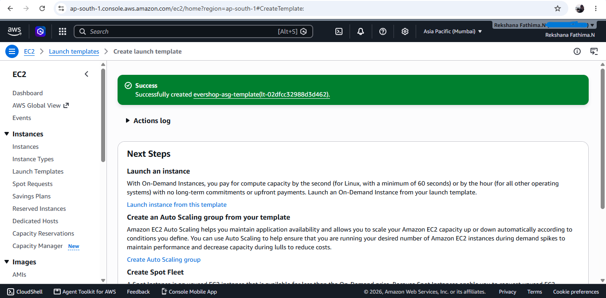
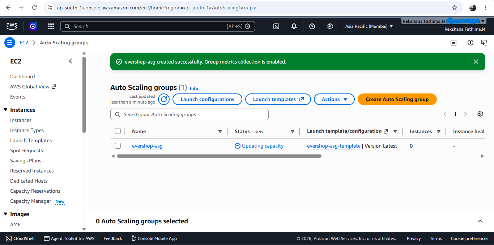

# Task 3 — Auto Scaling with Mixed Instances and Chaos Testing

## Project Overview

Build a highly available Evershop application tier using an EC2 Auto Scaling Group with a mix of On-Demand and Spot Instances across multiple Availability Zones. The architecture uses an Application Load Balancer, health checks, lifecycle hooks, CPU and ALB request-based scaling, and chaos testing to validate application resilience.

## Architecture

The following diagram represents the AWS infrastructure designed for the highly available Evershop application tier.

## Application Load Balancer

The Application Load Balancer will distribute incoming application traffic across healthy EC2 instances.

### 18. Launch Template
The Launch Template defines the configuration used when new EC2 instances are launched by the Auto Scaling Group.

### 19. Auto Scaling Group
The Auto Scaling Group was configured to manage the required EC2 capacity and maintain the desired number of instances.

