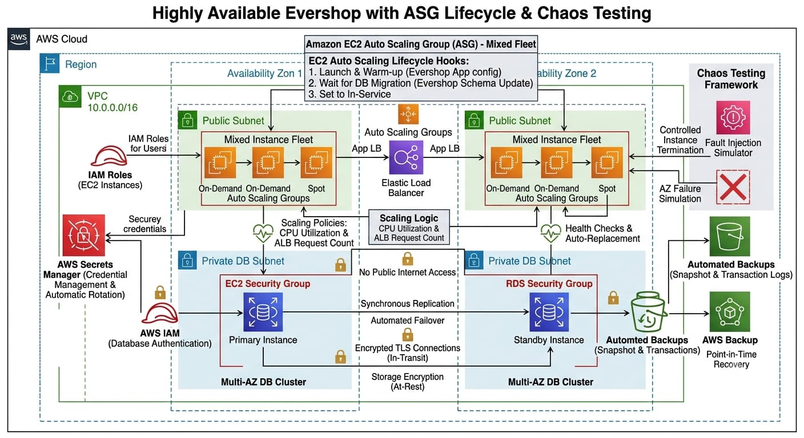

# Task 3 — Auto Scaling with Mixed Instances and Chaos Testing

## Project Overview

Build a highly available Evershop application tier using an EC2 Auto Scaling Group with a mix of On-Demand and Spot Instances across multiple Availability Zones. The architecture uses an Application Load Balancer, health checks, lifecycle hooks, CPU and ALB request-based scaling, and chaos testing to validate application resilience.

## Architecture

The following diagram represents the AWS infrastructure designed for the highly available Evershop application tier.

## Auto Scaling Group

The Evershop application will use an Auto Scaling Group to maintain application availability across multiple Availability Zones.

## Mixed Instance Deployment

The Auto Scaling Group will use both On-Demand and Spot Instances to balance availability and infrastructure cost.

## Application Load Balancer

The Application Load Balancer will distribute incoming application traffic across healthy EC2 instances.

## Lifecycle Hooks

Lifecycle hooks will be used to perform warm-up and initialization tasks before instances receive production traffic.

## Scaling Policies

Scaling policies will use CPU utilization and Application Load Balancer request counts to dynamically adjust application capacity.

## Chaos Testing

The application architecture will be tested by terminating instances and simulating Availability Zone failures to validate high availability.
