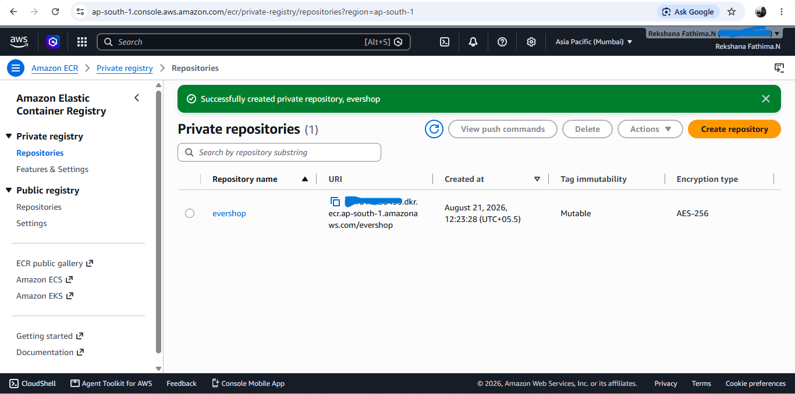
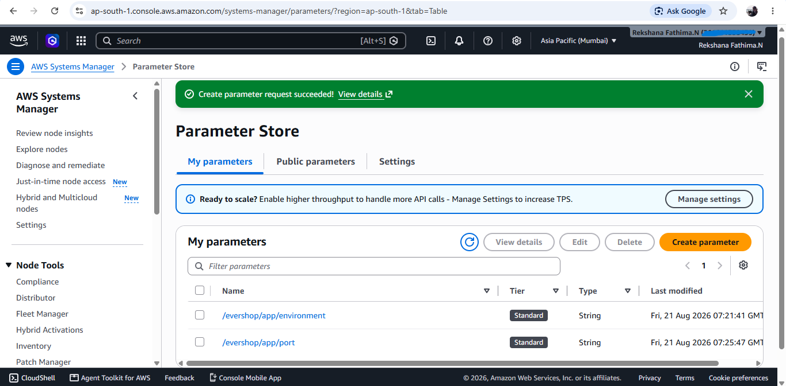
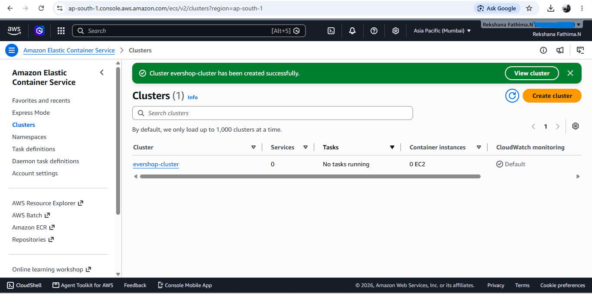
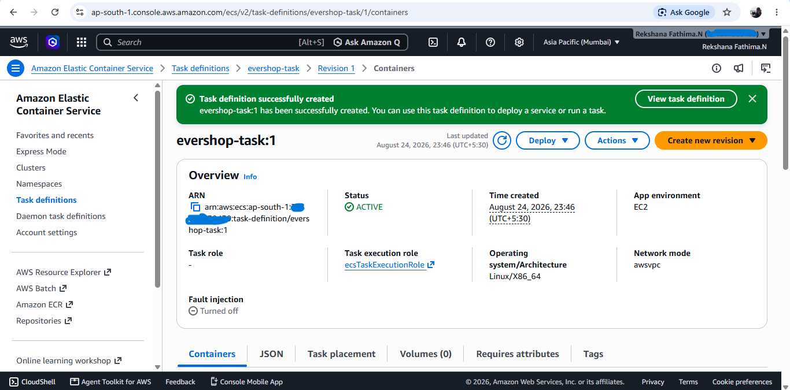
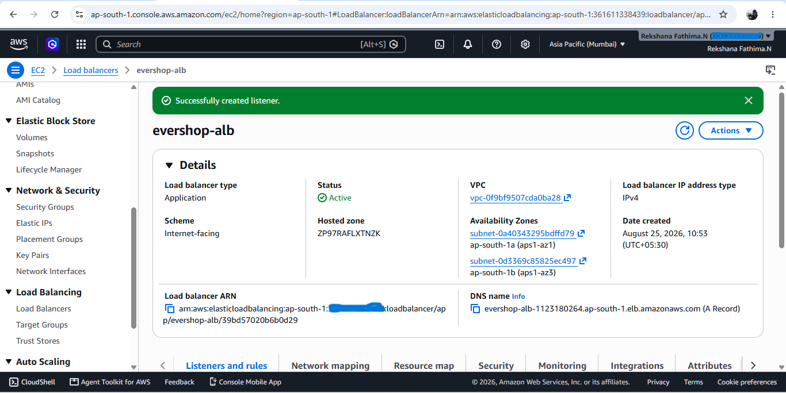
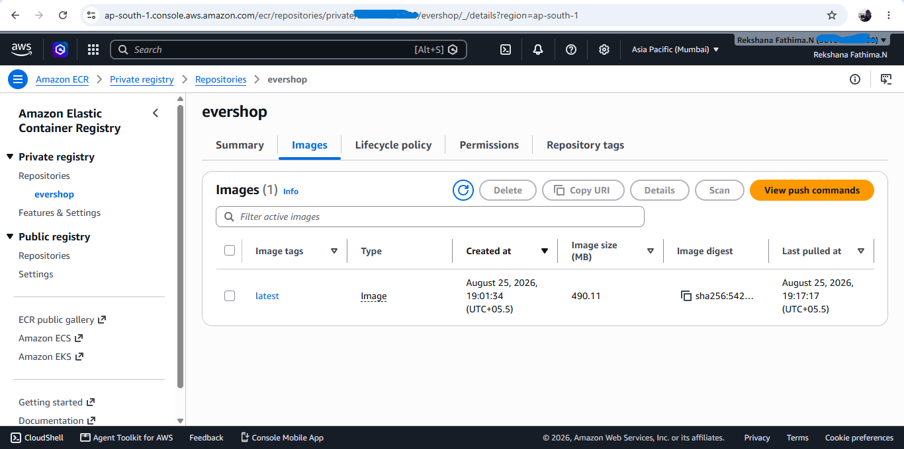
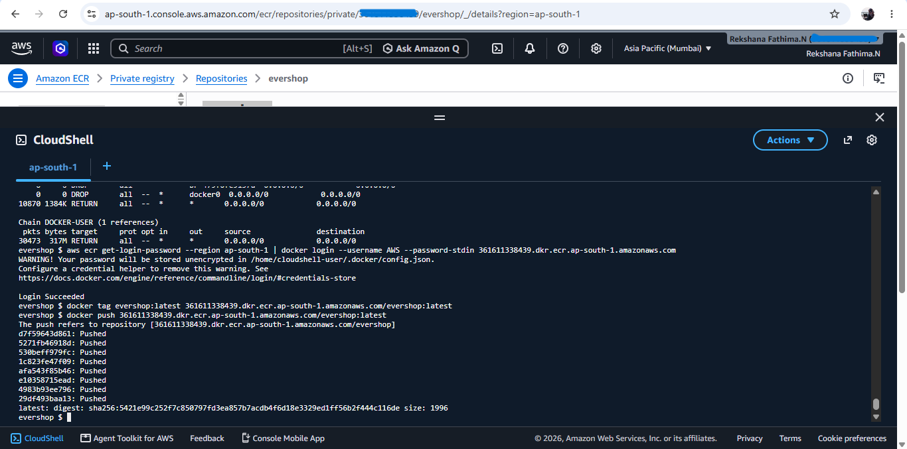
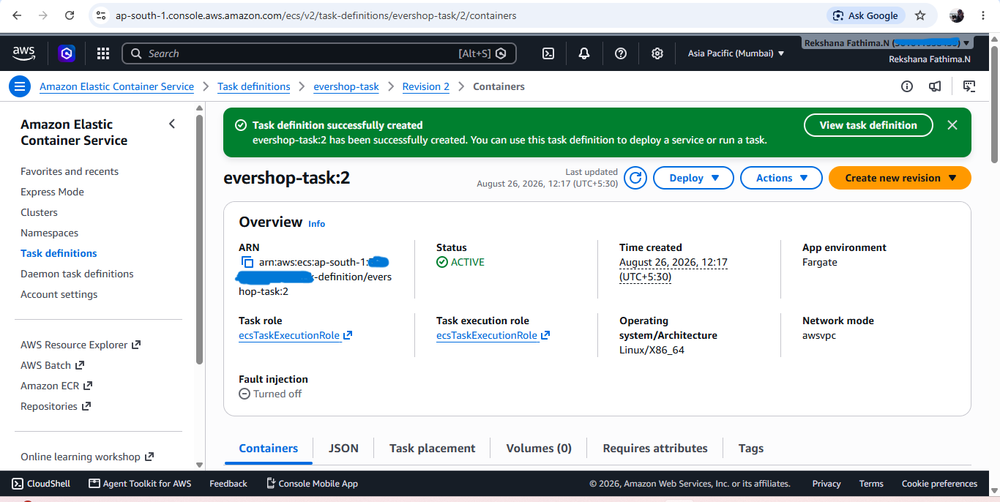

# Task 4 — Immutable E-commerce Deployment with ECS & ECR

## Project Overview

Containerize and deploy the Evershop application using Amazon ECS on EC2 instances with Amazon ECR for container image storage. Application configuration is managed through AWS Systems Manager Parameter Store, with AWS CodePipeline and CodeBuild planned for automated CI/CD and zero-downtime blue/green deployments.

## Architecture

The following diagram represents the AWS infrastructure designed for the containerized Evershop application deployment.

## 1. Amazon ECR Private Repository

Created a private Amazon ECR repository named `evershop` for storing Evershop container images.

## 2. AWS Systems Manager Parameter Store

Created Standard String parameters in AWS Systems Manager Parameter Store for Evershop application configuration.

The configured parameters are:

- `/evershop/app/environment` — `production`
- `/evershop/app/port` — `3000`

### 3. ECS Cluster
The ECS cluster provides the environment where the Evershop containerized application is deployed and managed.

### 4. Task Definition Containers
The task definition specifies the container image, port configuration, CPU and memory settings required to run the application.

### 5. Load Balancer
The Application Load Balancer provides traffic routing from the application endpoint to the running ECS tasks.

### 6. Images
The Evershop Docker image was created during ECS deployment.

### 7. Docker Image Pushed
The Evershop Docker image was built and pushed to Amazon ECR for use during the ECS deployment.

### 8. Task Definition – Revision 2
A new task definition revision was created to update the ECS deployment configuration.

### 9. ECS Service
The ECS service manages the running application tasks and maintains the desired task count.

![ECS Service](screenshots/31-ecs-services.png
