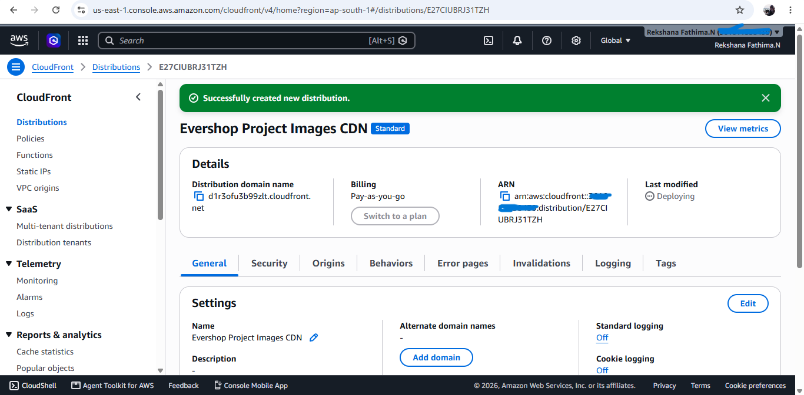
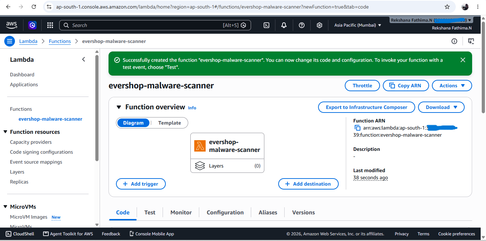

# Task 5 — CloudFront Distribution with Lambda@Edge Enhancements

## Project Overview

Build a secure and optimized Amazon CloudFront distribution for Evershop product images using a private Amazon S3 bucket with Origin Access Control. Lambda@Edge will enhance caching, security, and image optimization, while signed URLs will protect private assets and CloudFront metrics will be used to validate cache performance across geographic regions.

## Architecture

The following diagram represents the AWS infrastructure designed for secure and optimized Evershop content delivery.

### 1. CloudFront Distribution
The CloudFront distribution was configured to provide a CDN layer for delivering application content through AWS edge locations.

### 2. Lambda Function
The Lambda function was configured as part of the edge-processing workflow to modify or process requests at the CloudFront edge.

