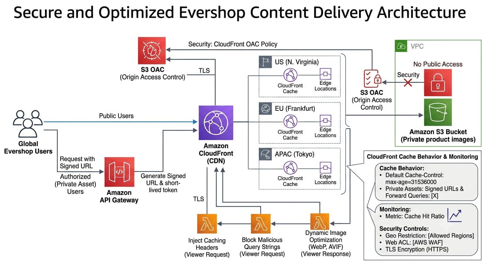

# Task 5 — CloudFront Distribution with Lambda@Edge Enhancements

## Project Overview

Build a secure and optimized Amazon CloudFront distribution for Evershop product images using a private Amazon S3 bucket with Origin Access Control. Lambda@Edge will enhance caching, security, and image optimization, while signed URLs will protect private assets and CloudFront metrics will be used to validate cache performance across geographic regions.

## Architecture

The following diagram represents the AWS infrastructure designed for secure and optimized Evershop content delivery.

## Private S3 Origin

A private Amazon S3 bucket will be used to store Evershop product images while preventing direct public access.

## CloudFront Origin Access Control

Amazon CloudFront will securely access the private S3 origin through Origin Access Control.

## Lambda@Edge Enhancements

Lambda@Edge will be used to modify caching behavior, block malicious query strings, and dynamically optimize image formats.

## Signed URLs

Short-lived signed URLs will be used to control access to private assets.

## Cache Performance

CloudFront cache hit ratios will be monitored across multiple geographic regions to validate content delivery performance.
