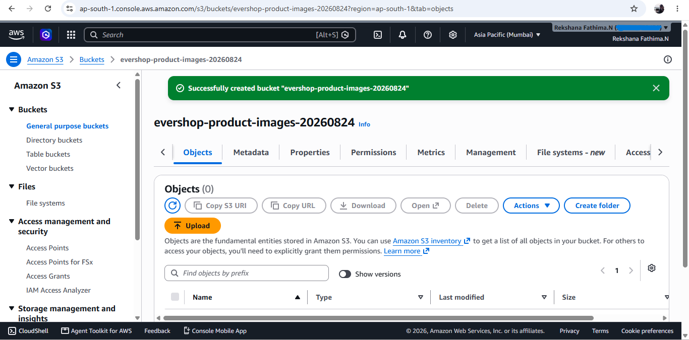
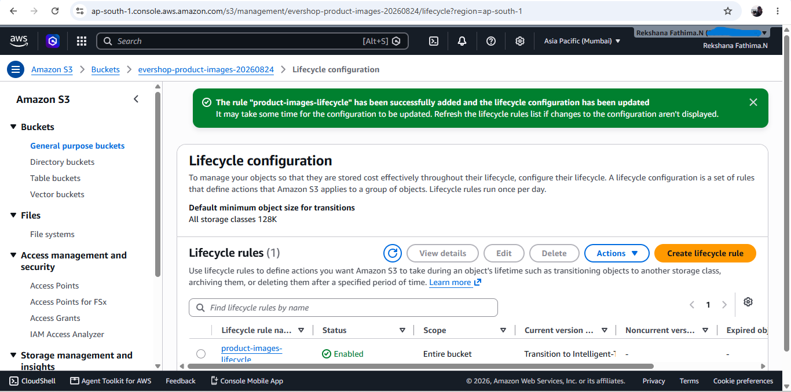
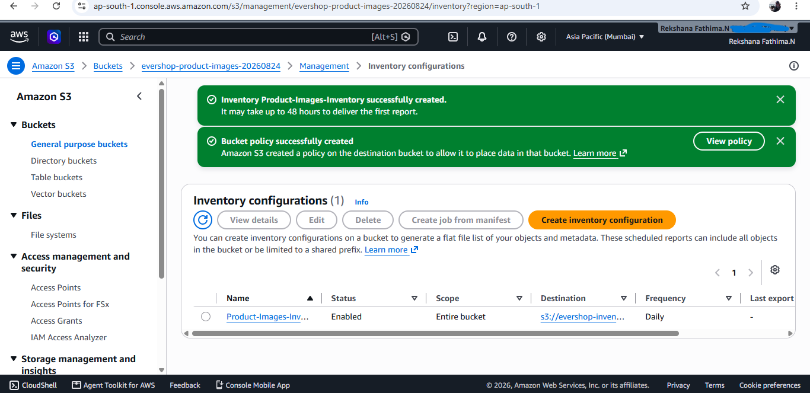

# Task 6 — Advanced S3 Storage for Product Images

## Project Overview

Create a secure and highly optimized Amazon S3 storage architecture for Evershop product images. The solution uses private bucket access, encryption, pre-signed URLs, CloudFront delivery, S3 Object Lambda transformations, lifecycle management, S3 Inventory, and automated malware scanning using Lambda and ClamAV.

## Architecture

The following diagram represents the AWS infrastructure designed for advanced Evershop product image storage and processing.

### 1. S3 Buckets
An S3 bucket was configured to store product images and related application assets.

### 2. Lifecycle Configuration
Lifecycle rules were configured to manage objects automatically and help control long-term storage usage.

### 3. Inventory Configuration
S3 Inventory was configured to provide scheduled information about objects stored in the bucket.

