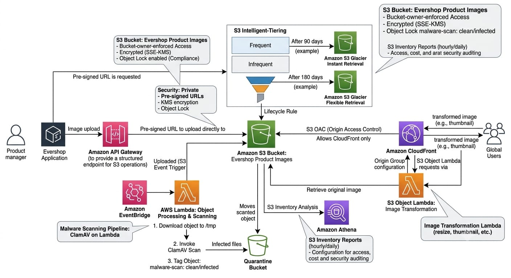

# Task 6 — Advanced S3 Storage for Product Images

## Project Overview

Create a secure and highly optimized Amazon S3 storage architecture for Evershop product images. The solution uses private bucket access, encryption, pre-signed URLs, CloudFront delivery, S3 Object Lambda transformations, lifecycle management, S3 Inventory, and automated malware scanning using Lambda and ClamAV.

## Architecture

The following diagram represents the AWS infrastructure designed for advanced Evershop product image storage and processing.

## Private S3 Bucket

A private S3 bucket will store Evershop product images with bucket-owner-enforced access and encryption enabled.

## Pre-signed URLs

Pre-signed URLs will provide controlled access for product image uploads and downloads.

## CloudFront Delivery

Amazon CloudFront will securely distribute product images from the private S3 origin.

## S3 Object Lambda

S3 Object Lambda will provide on-demand image transformations such as thumbnail generation.

## Lifecycle Management

S3 Intelligent-Tiering and Glacier transitions will be configured to optimize long-term storage costs.

## S3 Inventory

S3 Inventory will provide scheduled reports about objects stored in the product image bucket.

## Malware Scanning

New product image uploads will trigger a Lambda-based malware scanning workflow using ClamAV before the files are made available to the application.
