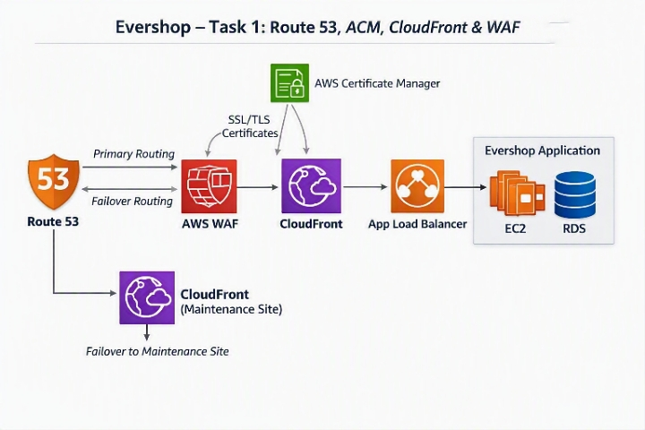

# Task 1 – Route 53 Domain Setup with ACM and WAF

## Objective

Configure secure and highly available domain access for the
Evershop application using Amazon Route 53, AWS Certificate
Manager (ACM), Amazon CloudFront, Application Load Balancer
(ALB), and AWS WAF.

## Implementation

- Configure Route 53 for the custom domain
- Provision ACM certificate for CloudFront
- Provision ACM certificate for the ALB
- Configure HTTPS
- Enforce HSTS headers
- Configure failover routing
- Create a CloudFront-hosted maintenance page
- Configure AWS WAF on CloudFront
- Configure AWS WAF on ALB
- Enable AWS managed security rules

## Architecture

Route 53 → CloudFront → ALB → Application

AWS WAF protects both CloudFront and ALB.

## Testing

- HTTPS access verification
- Certificate validation
- HTTP to HTTPS redirection
- HSTS verification
- WAF rule testing
- Failover routing testing

## Screenshots

Screenshots will be added as implementation progresses.

## Status

Completed

## Architecture diagram 

